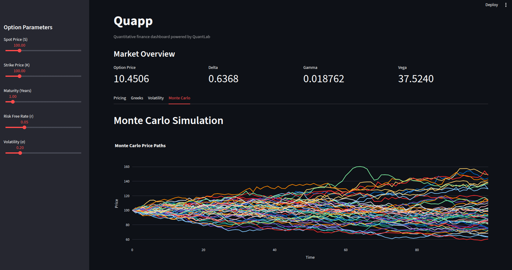

# Quapp

**Quapp** is an interactive quantitative finance dashboard built with **Streamlit** and powered by the **QuantLab** pricing library.

It allows users to explore European option pricing models, visualize risk sensitivities (Greeks), and compare analytical and numerical pricing approaches through an interactive interface.
## Dashboard Preview


---

## Features

### Option Pricing

* Black-Scholes analytical pricing
* Monte Carlo simulation pricing
* Interactive visualization of option value changes with:

  * Spot price
  * Volatility
  * Time to maturity

### Greeks Analysis

Visualize key option sensitivities:

* **Delta** — sensitivity to changes in the underlying asset price
* **Gamma** — rate of change of Delta
* **Vega** — sensitivity to volatility

### Implied Volatility

Explore the relationship between option prices and implied volatility through interactive curves.

### Monte Carlo Simulation

Visualize simulated underlying asset paths generated using geometric Brownian motion.

---

## Project Architecture

Quapp acts as the visualization layer on top of QuantLab.

```
Quapp
│
├── app.py                 # Streamlit application
│
├── charts/                # Interactive Plotly charts
│   ├── pricing.py
│   ├── greeks.py
│   ├── volatility.py
│   └── monte_carlo.py
│
├── requirements.txt
└── README.md
```

QuantLab provides:

* European option models
* Black-Scholes pricing
* Monte Carlo pricing
* Greeks calculations
* Implied volatility calculations

---

## Installation

### Prerequisites

Before running Quapp, make sure you have:

- Python 3.10+
- Git

### Clone the repository

```bash
git clone https://github.com/ayhamalashwal/Quapp.git
cd Quapp
```

### Create a virtual environment

```bash
python3 -m venv .venv
source .venv/bin/activate
```

### Install dependencies

```bash
pip install -r requirements.txt
```

This automatically installs **QuantLab** directly from GitHub.

### Run Quapp

```bash
streamlit run app.py
```
---

## Running the Dashboard

Start Streamlit:

```
streamlit run app.py
```

The dashboard will open automatically in your browser.

---

## Technologies

* Python
* Streamlit
* Plotly
* NumPy
* SciPy
* QuantLab

---

## Purpose

Quapp was created as an educational quantitative finance project to explore:

* Mathematical option pricing models
* Numerical simulation methods
* Financial risk sensitivities
* Interactive financial visualization

---

## Related Project

Quapp is powered by **QuantLab**, a Python quantitative finance library implementing the underlying pricing and mathematical models.

---

## Documentation

Detailed explanations of the models and mathematics:

- [Option Pricing](docs/pricing.md)
- [Option Greeks](docs/greeks.md)
- [Volatility Tools](docs/volatility.md)
- [QuantLab Architecture](docs/models.md)
---

## License

MIT License
